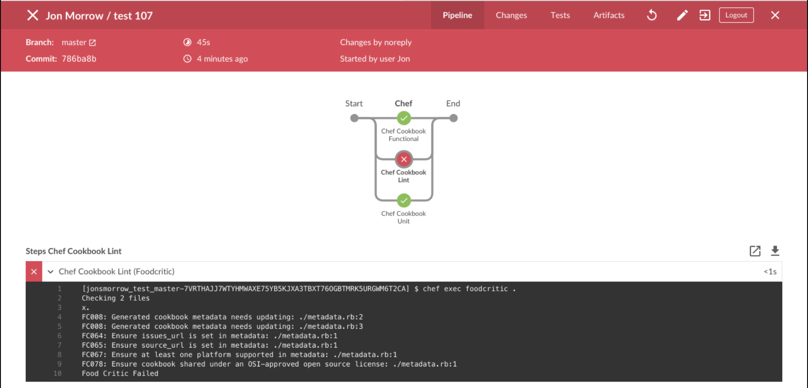

# chef-automate-plugin

## Getting Started

The Chef Automate Plugin for Jenkins makes it easy to build deployment pipelines for Chef cookbooks visually using Jenkins' Blue Ocean plugin. Currently the Chef Automate plugin has unit testing, linting, and functional testing capabilities using the following custom steps:
- Chef Cookbook Unit
- Chef Cookbook Lint (Foodcritic)
- Chef Cookbook Lint (Cookstyle)
- Chef Cookbook Functional

## Prerequisites

- Git
- Maven 3.5+
- JDK 1.8+
- [Github Personal Access Token] (https://github.com/blog/1509-personal-api-tokens) for the user with which you plan to log into the Jenkins console

## Setting up [kitchen-dokken] (https://github.com/someara/kitchen-dokken)

Kitchen-dokken is a driver for Chef Test Kitchen which enables rapid testing of Chef cookbooks using Docker. The Chef Automate Plugin installs kitchen-dokken automatically, but these setup steps help get everything ready to go.

First, create a work area for kitchen-dokken: 

```$ mkdir ~/.dokken```

Then, add var KITCHEN_YAML to your .bash_profile (or equivalent):

```$ echo "export KITCHEN_YAML=.kitchen.yml" >> ~/.bash_profile
$ source ~/.bash_profile
```

## Installing the Chef Automate Plugin

While the plugin is in development, the easiest way to install and run it is via Maven using a local copy of the GitHub repository. Download the repository located at https://github.com/chef/chef-automate-plugin.git. You'll need the right Maven settings, so create a settings.xml file at ~/.m2 and add the following Jenkins profile. If you already have a settings.xml file, you only need to add the bits you're missing.

```<settings>
  <pluginGroups>
    <pluginGroup>org.jenkins-ci.tools</pluginGroup>
  </pluginGroups>

  <profiles>
    <!-- Give access to Jenkins plugins -->
    <profile>
      <id>jenkins</id>
      <activation>
        <activeByDefault>false</activeByDefault> <!-- you could set this to false if you use Maven for more than just Jenkins development. if you do, make sure to always add the -P jenkins argument to Maven invocations -->
      </activation>
      <repositories>
        <repository>
          <id>repo.jenkins-ci.org</id>
          <url>https://repo.jenkins-ci.org/public/</url>
        </repository>
      </repositories>
      <pluginRepositories>
        <pluginRepository>
          <id>repo.jenkins-ci.org</id>
          <url>https://repo.jenkins-ci.org/public/</url>
        </pluginRepository>
      </pluginRepositories>
    </profile>
  </profiles>
  <mirrors>
    <mirror>
      <id>repo.jenkins-ci.org</id>
      <url>https://repo.jenkins-ci.org/public/</url>
      <mirrorOf>m.g.o-public</mirrorOf>
    </mirror>
  </mirrors>
</settings>
```

Build the plugin and run Jenkins:

```$ mvn -P jenkins -U hpi:run```

This command will build the Chef Automate plugin and launch Jenkins with the plugin installed. Copy the temporary admin password at the tail end of the Maven output; you'll need it to log in to the Jenkins console.

Go to the Jenkins console [login screen] (http://localhost:8080/jenkins). At the login prompt, log in as admin using the temporary admin password located in the Maven build/run output. Once you're logged in, you can either continue as admin or let Jenkins walk you through the creation of your first admin user. Either choice is fine, because in this scenario Jenkins will run as your own user regardless of which user you use to log in to the Jenkins console.

Install plugin runtime dependencies:

Once you're logged in to the Jenkins console, install the Warnings Plug-in. Click Manage Jenkins on the left nav, then click Manage Plugins. Click the Available tab, then enter Warnings in the filter box just above the plugins list on the right. Click the checkbox next to Warnings Plug-in in the plugins list, then click Install Without Restart. When the plugin is installed, navigate back to the main Jenkins dashboard by clicking the Jenkins breadcrumb on the top left.

## Chef Automate Plugin: ChefDK/Docker Scenario

The Chef Automate Plugin supports different topologies, but the variation described here consists of a local standalone workstation running Docker and Jenkins as Jenkins master. To execute the test cookbook pipeline, Jenkins master spins up a Docker container running ChefDK as a Jenkins worker. The stages and steps of the pipeline invoke ChefDK operations which perform unit testing, linting (Foodcritic, Cookstyle), and functional testing (Test Kitchen) of Chef cookbooks. Test Kitchen spins up additional Docker containers as siblings to its own container in which to execute functional testing of cookbooks on different platforms.

## Creating the Test Cookbook Pipeline

Go to the Jenkins console and click Open Blue Ocean in the left nav. Click New Pipeline on the ride side of the screen. Blue Ocean will walk you through the creation of a pipeline based on the Jenkinsfile in [test cookbook]:

- For code store, click GitHub
- For organization, click Chef
- For pipeline creation, click New Pipeline (from a single repository)
- Select the Test Cookbook repo from the list of repos, then click Create Pipeline

Blue Ocean will build and run the test cookbook pipeline for you. You should see something similar to the screenshot below, which shows the test cookbook pipeline with unit, lint, and functional stages reporting a Foodcritic failure.



# License

```
Licensed under the Apache License, Version 2.0 (the "License");
you may not use this file except in compliance with the License.
You may obtain a copy of the License at

    http://www.apache.org/licenses/LICENSE-2.0

Unless required by applicable law or agreed to in writing, software
distributed under the License is distributed on an "AS IS" BASIS,
WITHOUT WARRANTIES OR CONDITIONS OF ANY KIND, either express or implied.
See the License for the specific language governing permissions and
limitations under the License.
```
